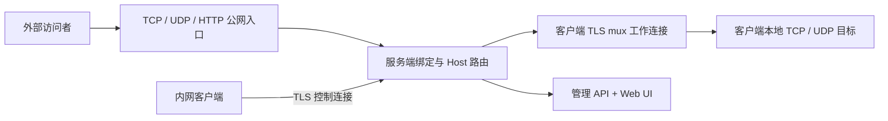

# 自部署内网穿透系统：Java + Netty 开发文档

当前实现：0.4.0（2026-09-22）。本文以仓库代码为准，描述 TCP 多路复用、UDP、HTTP/HTTPS 路由、动态映射、健康检查、负载均衡、限速和管理认证的实际实现与验收方式。

## 1. 已实现范围

- TLS 控制连接：客户端认证、规则注册、心跳、断线重连。支持兼容旧配置的共享 token，以及 `clientsFile` 中按 `clientId=token` 配置的独立客户端凭据。
- TCP 多路复用：每个客户端可建立多条 TLS 工作连接；所有 TCP/HTTP 流使用 `streamId + type + length + payload` 帧复用，并按连接可写状态做背压。
- UDP：服务端为每条 `udp.*` 规则监听一个 UDP 端口，按外部源地址建立逻辑流，保持每个数据报的边界。
- HTTP/HTTPS 路由：服务端监听 `httpPort` 或 `httpsPort`，支持 Host/SNI 回退、URL 前缀、Host 重写、Basic Auth 和 X-Forwarded-For。
- 动态映射：管理 API 可以新增、查询、删除客户端映射，并通过 `storeFile` 持久化，客户端重连后自动恢复。
- 健康与治理：支持 `health.*` 健康检查、`balance.*` 组负载均衡和 `bandwidth.*` 每映射限速。
- 管理界面：服务端默认 `127.0.0.1:8088` 提供运行态仪表盘和 JSON API，可查看客户端、映射和活动流，也可断开客户端；支持 `managementTokenFile` Bearer 认证和 `/metrics` Prometheus 指标。
- TLS、共享令牌、证书校验、端口范围限制、基本连接数配额和连接关闭清理。

当前仍未包含多服务端集群、TCP 半关闭保留、自动证书轮换和 QUIC/KCP/WebSocket 传输。HTTPS 入口使用服务端配置的证书终止 TLS，再按 Host/SNI 路由到客户端 HTTP 服务。

## 2. 网络架构



客户端有两条长期连接：

1. 控制连接：文本行协议，只传认证、规则注册、动态配置、健康状态、`OPEN`、心跳和错误。
2. 工作连接池：客户端按 `muxPoolSize` 建立多条 TLS 工作连接；TLS 握手完成后交换 `MUX 2 <clientId> <token>`，随后转换成二进制 mux 帧。每个帧包含 4 字节大端 stream id、1 字节类型、4 字节大端 payload 长度和 payload，最大 payload 为 64 KiB。

帧类型为：

| 类型 | 方向 | 作用 |
| --- | --- | --- |
| `OPEN_TCP`（控制行 `OPEN`） | 服务端 → 客户端 | 请求客户端连接一条本地 TCP/HTTP 流。stream id 仍通过控制连接发送，数据在 mux 连接承载。 |
| `OPEN_UDP` | 服务端 → 客户端 | 请求客户端为一个外部 UDP 源地址连接本地 UDP 目标。 |
| `ACK` | 客户端 → 服务端 | 本地目标已经建立，可以开始转发。 |
| `DATA` | 双向 | 原始 TCP 字节或一个完整 UDP 数据报。大数据按 64 KiB 分片。 |
| `CLOSE` | 双向 | 关闭逻辑流及其两端资源。 |
| `PING` | 双向 | 连接级保活探测，使用 stream id `0` 和递增序号。 |
| `PONG` | 双向 | 对端返回对应序号；90 秒未收到有效响应则关闭 mux。 |

TCP/HTTP 字节路径是 `访问者 ↔ 服务端 Channel ↔ mux DATA ↔ 客户端本地 Channel ↔ 内网服务`。UDP 路径是 `访问者 DatagramPacket ↔ 服务端 UDP 监听 ↔ mux DATA ↔ 客户端 DatagramChannel ↔ 内网 UDP 服务`。

## 3. 配置

服务端配置：

```properties
bindHost=0.0.0.0
controlPort=7000
workPort=7001
publicBindHost=0.0.0.0
allowedPortStart=20000
allowedPortEnd=40000
httpPort=8080
httpBindHost=0.0.0.0
# httpsPort=8443
# httpsBindHost=0.0.0.0
managementPort=8088
managementBindHost=127.0.0.1
# managementTokenFile=/etc/tunnel/management-token
# storeFile=/var/lib/tunnel/mappings.properties
# muxPoolSize=2
# maxPendingBytes=8388608
tokenFile=/etc/tunnel/token
# clientTokenFile=/etc/tunnel/client-home-pc.token
certFile=/etc/tunnel/server.crt
keyFile=/etc/tunnel/server.key
```

客户端规则：

```properties
map.ssh=22022,127.0.0.1,22
udp.dns=25353,127.0.0.1,53
http.web=example.com|www.example.com,127.0.0.1,8080
```

`map.*` 是 TCP，`udp.*` 是 UDP，`http.*` 的第一个字段是 `|` 分隔的 Host 列表。HTTP 规则不占用 `allowedPortStart/allowedPortEnd` 范围，而是共享服务端的 `httpPort`/`httpsPort`。规则名和客户端 ID 只允许 `[A-Za-z0-9_-]`；Host 会被标准化为小写并去除末尾点。可选的 `http.<name>.locations`、`http.<name>.hostRewrite`、`http.<name>.basicUser`、`http.<name>.basicPassword` 分别配置路径、Host 重写和 Basic Auth；`balance.<name>=group,key`、`health.<name>=tcp|http,timeout,maxFailed,interval`、`bandwidth.<name>=1MB|1KB` 配置负载均衡、健康检查和限速。

## 4. 控制协议

TLS 建立后，客户端发送 `HELLO 2 <clientId> <token>`。登录成功后服务端返回 `HELLO_OK 2`，客户端根据规则类型发送：

```text
REGISTER <name> <remotePort> [group groupKey bandwidth health]
REGISTER_UDP <name> <remotePort> [group groupKey bandwidth health]
REGISTER_HTTP <name> <host1|host2> [locations hostRewrite basicUser basicPassword group groupKey bandwidth health]
```

服务端返回对应的 `*_OK` 或 `*_FAIL`。客户端收到服务端的 `OPEN <streamId> <ruleName>` 后连接本地 TCP 目标，并在 mux 工作连接发送 `ACK`。UDP 首个数据报到达时服务端发送 `OPEN_UDP`，客户端连接本地 UDP 目标后发送 `ACK`。

工作连接的明文登录行只允许出现在 TLS 握手之后；登录成功立即移除行解码器和 15 秒握手超时，替换为 `Mux.Decoder`、`Mux.Encoder` 和流处理器。mux 解码器拒绝非法 stream id、负长度和超过 64 KiB 的 payload；stream id `0` 仅用于连接级 PING/PONG 心跳帧。

## 5. HTTP Host 路由

服务端 `httpPort > 0` 时启动独立的明文 HTTP 监听。每个连接最多缓存 64 KiB 请求头，找到 `Host` 后在客户端注册表中查找精确域名（大小写不敏感）。命中后把包含请求头的原始字节作为该 mux 流的初始 payload 转发，因此不会重写 HTTP 方法、路径或请求头。未命中返回 404，缺少 Host 返回 400，超过头部限制返回 431。

HTTPS 入口由 Netty TLS 终止，读取 HTTP Host；缺少 Host 时使用 TLS ClientHello 的 SNI。当前仍是 HTTP/1.x 原始转发，不提供通配符证书和 HTTP/2。

## 6. 独立凭据、协议错误码和指标

服务端配置 `clientsFile` 后，每行按 Java properties 语法配置一个客户端身份，例如：

```properties
home-pc=home-pc-long-random-token-012345
office-pc=office-pc-long-random-token-012345
```

客户端使用 `clientTokenFile` 指向自己的 token 文件；未配置时仍使用旧的 `tokenFile`。控制和 mux 登录行都携带协议版本 `2`，错误统一返回 `ERROR <code> <detail>`，当前错误码包括 `AUTH_FAILED`、`VERSION_MISMATCH`、`CONFLICT` 和 `BAD_COMMAND`。

管理 API 配置 `managementTokenFile` 后要求 `Authorization: Bearer <token>`；管理页面会把 token 保存在浏览器本地存储。`GET /metrics` 输出低基数 Prometheus 指标，包括在线客户端、mux 连接、活动流、流生命周期、字节数和认证失败数。

动态映射使用 `storeFile` 持久化。管理 API 以 `application/x-www-form-urlencoded` 接收新增映射，例如 `POST /api/clients/home-pc/bindings` 的字段包括 `name`、`kind`、`remotePort`、`localHost`、`localPort`、`hosts`、`locations`、`balanceGroup`、`balanceKey`、`health` 和 `bandwidth`；`GET` 查询，`DELETE /api/clients/<id>/bindings/<name>` 删除。新增和删除会通过控制连接同步到客户端。

## 7. UDP 设计

服务端每条 UDP 规则绑定一个 `NioDatagramChannel`。外部源地址（IP+端口）是逻辑流的 key；服务端为该 key 分配 stream id，并把每个 `DatagramPacket` 原样作为一帧 `DATA` 发送。客户端为每个逻辑流创建一个已连接的 `NioDatagramChannel`，目标固定为规则声明的本地地址。120 秒没有数据后逻辑流清理。

UDP 不提供 TCP 式顺序、重传或拥塞控制；mux 工作连接本身使用 TCP，因此公网 UDP 的包会受工作连接的可靠传输影响，适合 DNS、游戏控制包等低速场景，不等价于原生 UDP 性能。

## 8. 管理 API 与界面

管理服务使用 JDK 自带 `HttpServer`，不占用 Netty 工作端口：

| 方法 | 路径 | 作用 |
| --- | --- | --- |
| `GET` | `/` | 深色运维仪表盘，3 秒刷新。 |
| `GET` | `/api/status` | 返回在线客户端、mux 状态、规则类型/端口/域名和活动流数量。 |
| `POST` | `/api/clients/<clientId>/disconnect` | 关闭指定客户端控制连接，客户端会按退避策略重连。 |
| `GET` | `/api/clients/<clientId>/bindings` | 查询动态映射。 |
| `POST` | `/api/clients/<clientId>/bindings` | 以表单新增或更新动态映射。 |
| `DELETE` | `/api/clients/<clientId>/bindings/<name>` | 删除动态映射。 |
| `GET` | `/metrics` | 输出 Prometheus 文本格式指标。 |

默认只绑定回环地址；如果必须远程访问，应通过防火墙、VPN 或带认证的反向代理暴露，不能直接把未认证管理 API 发布到公网。

## 9. 代码结构与验收

```text
Settings.java       规则类型、端口、Host 和配置校验
DynamicStore.java   动态映射持久化与控制消息编码
Metrics.java        Prometheus 指标采集与输出
Wire.java           控制行和认证辅助
Mux.java            mux 帧编码/解码、64 KiB 上限
Server.java         控制服务、公网 TCP/UDP/HTTP、mux 服务端、状态快照
Client.java         控制注册、mux 客户端、本地 TCP/UDP 目标、重连
Management.java     管理 API 和静态界面服务
Relay.java          旧的直连转发辅助（保留作兼容代码）
Smoke.java          TLS/TCP/复用/重连集成测试
FeatureSmoke.java   UDP、HTTP Host、管理 API 集成测试
```

标准环境运行：

```sh
mvn package
java -cp "target/test-classes;target/tunnel-0.4.0.jar" dev.tunnel.Smoke
java -cp "target/test-classes;target/tunnel-0.4.0.jar" dev.tunnel.FeatureSmoke
```

验收必须覆盖：TCP 二进制往返、1 MiB 分片、并发短连接、客户端重启和多 mux；UDP 数据报边界和回包；HTTP/HTTPS Host/SNI、路径路由和未知 Host；健康检查、动态映射增删、管理 API 状态和断开动作。发布前还应补充错误凭据、端口冲突、mux 握手超时、慢读、资源上限和证书轮换测试。

## mux 工作连接保活

mux 握手成功后，客户端和服务端每 20 秒发送连接级 PING，收到后回复相同序号的 PONG；连续 90 秒未收到有效 PONG 时关闭该 mux。客户端观察到 mux 关闭后按 1、2、4…最多 30 秒的退避间隔重连，并在成功后继续补足 muxPoolSize。该心跳属于协议版本 2；正在故障 mux 上的数据流会随连接关闭而失败，重连只恢复连接池容量。
